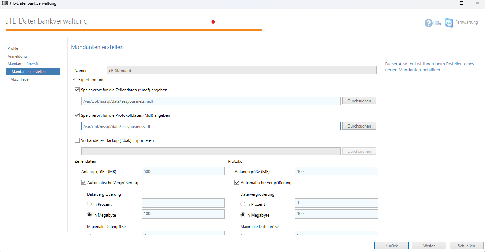

# MSSQL Server für JTL-Wawi

Das Skript run.sh bietet einfache Befehle zur Verwaltung des MSSQL Containers

## Installation
```bash
./run.sh install
```
Erstellt das Verzeichnis für die Datenbankdateien und setzt die notwendigen Berechtigungen.

## Starten des Containers
```bash
./run.sh start
```
Startet den MSSQL Container im Hintergrund.

## Stoppen des Containers
```bash
./run.sh stop
```
Stoppt den laufenden MSSQL Container.

## Entfernen des Containers und der Volumes
```bash
./run.sh remove
```
Stoppt den Container, entfernt alle Volumes und löscht das Verzeichnis für die Datenbankdateien.


## JTL Einstellung DB-Path ( Datenbank Expertenmodus)
